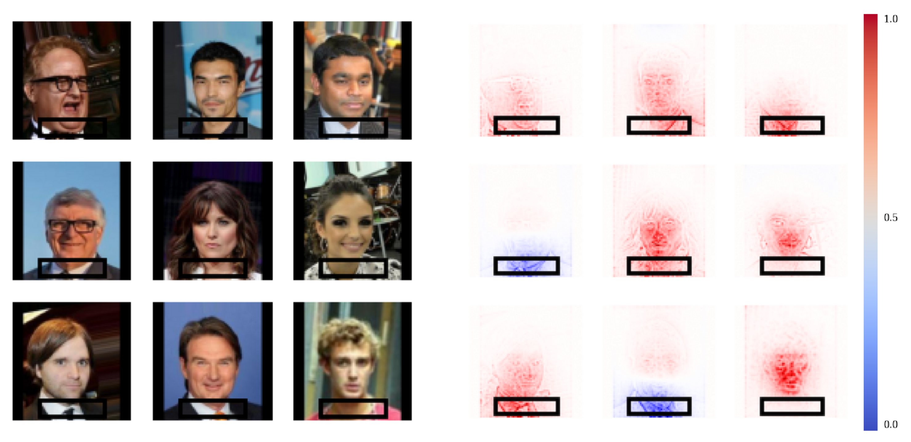

## Metrics for quantitative analysis of the effectiveness of debiasing and artifact removal methods through the lens of saliency maps

This repository contains code that was used in "Investigating the Relationship Between Debiasing and Artifact Removal using Saliency Maps" paper at XAI-2025 conference. Arxiv link: https://arxiv.org/abs/2503.00234


## Installation

```bash
pip install -r requirements.txt
```

## A minimalistic example
```python
import torch
import torchvision
import detoxai
from detoxai.visualization import SSVisualizer

# Internal imports
from metrics import XAIMetricsCalculator
from lrp import LRPHandler

# Dummy model initialization (Replace with your actual model)
model = torchvision.models.resnet18(weights=torchvision.models.ResNet18_Weights.DEFAULT)
model.fc = torch.nn.Linear(model.fc.in_features, 2)  # Binary classification

# Dummy data (Replace with your actual data)
# X: input data, Y: binary labels, PA: binary protected attribute
X = torch.rand(128, 3, 224, 224)
Y = torch.randint(0, 2, size=(128,))
PA = torch.randint(0, 2, size=(128,))

dataloader = torch.utils.data.DataLoader(list(zip(X, Y, PA)), batch_size=32)

r = detoxai.debias(model, dataloader, methods=["RRCLARC"], return_type="all")
debiased_model = r["RRCLARC"].get_model()

lrp = LRPHandler(n_classes=2)
calculator = XAIMetricsCalculator(dataloader, lrp, n_classes=2)

metrics = calculator.calculate_metrics(
    debiased_model,  # Model to evaluate
    rect_pos=(20, 80),  # Upper left corner of the rectangle
    rect_size=(100, 100),  # Width and height of the rectangle
    vanilla_model=model,  # Model to compare against, usually the original model
    sailmap_metrics=["RRF", "HRF", "ADR", "RDDT"],  # Metrics to calculate
)

for metric, values in metrics.items():
    print(f"{metric}: {values['mean']:.4f} ± {values['std']:.4f}")

visualizer = SSVisualizer(
    dataloader,
    model,
    lrp,
    draw_rectangles=True,
    rectangle_config={
        "rect": (40, 40, 150, 80),  # x, y, width, height
    },
)

visualizer.visualize_batch(batch_num=0, show_labels=False, max_images=16)
visualizer.local_save("images/example.png")
```

**Outputs:**
```bash
RRF: 0.2551 ± 0.1072
HRF: 0.0862 ± 0.0908
ADR: 0.0036 ± 0.0134
RDDT: 0.0000 ± 0.9802
```



***
### MIT License
